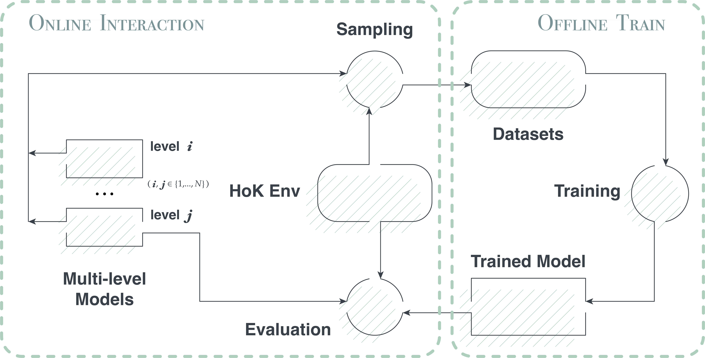

# **HoK Offline**

Here is the open-access code for our paper "HoK Offline: Investigating Solo and Team Dynamics in a Rich MOBA Dataset from Honor of Kings". Based on this code, you can realize the comprehensive process for offline RL and offline MARL based on Honor of Kings Arena (HoK Arena) and Honor of Kings Multi-Agent Arena (HoK MA2). The framework is demonstrated as follow:

    

## **Installation**

### **HoK Env**

Our framework is based on Honor of Kings environment, please install the [**hok environment and the gamecore**](https://github.com/tencent-ailab/hok_env) first.

For running on Linux, based on the introductions in [**docs/run_windows_gamecore_on_linux.md**](https://github.com/tencent-ailab/hok_env/blob/master/docs/run_windows_gamecore_on_linux.md), you can make a gamecore docker image. Then by running the following example commands, you can start a gamecore server container for hok1v1 or hok3v3.

    # hok1v1 gamecore server container
    docker run --name gamecore1v1 -d --network host --restart=always -e SIMULATOR_USE_WINE=1 -e GAMECORE_SERVER_BIND_ADDR=":23333" gamecore:latest bash -c "bash /rl_framework/remote-gc-server/run_and_monitor_gamecore_server.sh"
    
    # hok3v3 gamecore server container
    docker run --name gamecore3v3 -d --network host --restart=always -e SIMULATOR_USE_WINE=1 -e GAMECORE_SERVER_BIND_ADDR=":23432" gamecore:latest bash -c "bash /rl_framework/remote-gc-server/run_and_monitor_gamecore_server.sh"

### **Multi-Level Models**

The Multi-Level Models we presented in the paper can be download from the following link: [**for HoK Arena(1v1)**](https://kaiwu-assets-1258344700.cos.ap-shanghai.myqcloud.com/paper/hok-offline/1v1/1v1baselines.zip) and [**for HoK MA2(3v3)**](https://kaiwu-assets-1258344700.cos.ap-shanghai.myqcloud.com/paper/hok-offline/3v3/3v3baselines.zip). Please download these models and unzip them into folder **hok1v1** and folder **hok3v3** respectively. Here is the code example:

    # download multi-level models for HoK Arena
    cd hok1v1
    wget https://kaiwu-assets-1258344700.cos.ap-shanghai.myqcloud.com/paper/hok-offline/1v1/1v1baselines.zip
    unzip 1v1baselines.zip
    rm 1v1baselines.zip
    mv 1v1baselines baselines

    # download multi-level models for HoK MA2
    cd hok3v3
    wget https://kaiwu-assets-1258344700.cos.ap-shanghai.myqcloud.com/paper/hok-offline/3v3/3v3baselines.zip
    unzip 3v3baselines.zip
    rm 3v3baselines.zip
    mv 3v3baselines baselines

### **Requirements**

The python version we use is Python 3.7.13

Please install other requirements by:

    pip install -r requirements.txt

## **Sample**

    cd hok3v3
    sh offline_sample/scripts/start_sample.sh <levels_str> <eval_num> <cpu_num> <datasets_repo_name>`<backend>` <dataset_name>
    #e.g.
    bash offline_sample/scripts/start_sample.sh 1,1 20 50 3v3version1 tensorflow norm_medium

Please refer to 'start_sample.sh' and 'sample.sh' for details.

**levels_str**: the levels of pre-trained models used for sampling, e.g. '1,1' for norm_medium, '2,1' for norm_expert and 'medium' for gain_gold_medium

**eval_num & cpu_num**: the sample module will start **cpu_num** parallel processes and each process will sample **eval_num** episodes, i.e. the total num of sampled trajectories is **cpu_num*eval_num**.

**dataset_repo_name**: the sampled datasets will be stored in either "hok1v1/datasets" or "hok3v3/datasets" directory, while **dataset_repo_name**  represents the name of the datasets repository subdirectory within the "datasets" folder.

**backend**: refers to the selection of either "pytorch" or "tensorflow" models for the sampling process.

**dataset_name**: refers to the name of the dataset and the folder name within the "/datasets/**dataset_repo_name**" directory in which the sampled hdf5 files are stored.

**Notations:**

1. The sampled data is saved into hdf5 files. Assuming that **levels_str**='model1,model2', the samples collected in the nth parallel sampling process will be stored in n_0.hdf5 and n_1.hdf5, where n_0.hdf5 contains the data for model1 and n_1.hdf5 contains the data for model2. Therefore, further processing is necessary in order to build a standardized offline reinforcement learning dataset.
2. During parallel sampling, some of the sampling processes may fail for various gamecore reasons. Apart from checking the log files in "offline_sample/logs", you can use the "tools/remove_and_rename.py" tool to verify if the collected data files are readable and complete.

## **Train**

    cd hok3v3
    python offline_train/train.py --root_path=offline_logs --replay_dir=datasets --dataset_name=norm_medium --run_prefix=run_indbc_0

**Notations:**

1. The models and train_logs and tensorboard files will be saved into the directory 'hokoff/hok3v3/offline_logs/run_indbc_0' which follows the format "<root_path>/<run_prefix>"
2. The format for the run_prefix is 'run_<algorithm_name>_<experiment_id>'. Please adhere to this format unless you are modifying the code for your own purposes.

## **Evaluate**

    cd hok3v3
    python offline_eval/evaluation.py --root_path=offline_logs --run_prefix=run_indbc_0 --levels=1 --cpu_num=10 --eval_num=2 --final_test=0 --tensorflow_oppo=1 --max_steps=500000 --dataset_name=norm_medium

**Notations:**

1. We initially included the evaluation process in the training module in the form of a subprocess. However, we discovered that it resulted in reduced training efficiency. Thus, we decided to separate the evaluation process into a standalone module.
2. The <root_path> and <run_prefix> have the same meaning as in training module.
3. The `<levels>` represents the level of the opponents for evaluation and <tensorflow_oppo> represents the opponents load tensorflow pretrained models if =1 else pytorch.
4. <cpu_num> and <eval_num> have the same meaning as in sampling module and the total number of evaluation trajectories is **cpu_num*eval_num**.
5. <final_test>: A value of 1 means that only the last three models will be evaluated, and their average performance will be recorded into 'offline_logs/final_win_rate.xlsx' as final performance. A value of 0 indicates that the system will continuously monitor the model pool and evaluate the latest model whenever a new model is added, until <max_steps> is reached.

## **Acknowledgement**

We gratefully acknowledge the support and contributions from Tencent TiMi Studio and Tencent AI Lab in our research. Portions of the code used in this work are adapted from the open-source code of [hok_env](https://github.com/tencent-ailab/hok_env). Specifically, we thank the developers  for making their code available for reuse. Without their efforts, our research would not have been possible. We sincerely appreciate their generosity and the impact they have on our work.
